# Dynamic Event Invitation System — Architecture & Design Document

---

## Table of Contents

1. [Project Overview](#1-project-overview)
2. [Requirements Analysis](#2-requirements-analysis)
3. [Identified Missing Requirements](#3-identified-missing-requirements)
4. [System Architecture](#4-system-architecture)
5. [Frontend Architecture](#5-frontend-architecture)
6. [Backend Services](#6-backend-services)
7. [Drag-Drop Widget Service](#7-drag-drop-widget-service)
8. [Database Design](#8-database-design)
9. [Theme System](#9-theme-system)
10. [Event URL & Slug Strategy](#10-event-url--slug-strategy)
11. [Countdown Timer System](#11-countdown-timer-system)
12. [Auth & Access Control](#12-auth--access-control)
13. [RSVP & Guest Management](#13-rsvp--guest-management)
14. [Notifications](#14-notifications)
15. [Media & Asset Management](#15-media--asset-management)
16. [Analytics & Tracking](#16-analytics--tracking)
17. [Infrastructure & DevOps](#17-infrastructure--devops)
18. [External Integrations](#18-external-integrations)
19. [Technology Stack Summary](#19-technology-stack-summary)
20. [Development Roadmap](#20-development-roadmap)

---

## 1. Project Overview

A fully dynamic event invitation platform where administrators can create custom-themed, drag-and-drop-built event pages — each accessible via a unique, human-friendly URL. Guests receive invitation links, view event details on a beautifully rendered page, and optionally RSVP — all without any hardcoded UI.

**Core value proposition:**

- Every event has a completely unique visual identity (theme, layout, colors, fonts)
- Admins build the event page visually — no code required
- Dynamic field system supports any event type (weddings, conferences, birthdays, corporate)
- Countdown, RSVP, and guest tracking built in
- Easily extensible via a plugin-based widget architecture

---

## 2. Requirements Analysis

### Functional requirements

| # | Requirement | Priority |
|---|-------------|----------|
| FR-01 | Each event has a unique URL in the format `/{event-slug}` | High |
| FR-02 | Event page UI is fully dynamic — layout, theme, colors, text, sections | High |
| FR-03 | Admin can drag-and-drop UI sections to define page structure | High |
| FR-04 | Drag-drop system is a separate, extensible service | High |
| FR-05 | Each event has its own theme (colors, fonts, background) | High |
| FR-06 | Text colors are individually configurable per section | High |
| FR-07 | Countdown timer widget showing time to event | High |
| FR-08 | Support for dynamic/custom text fields per event type | High |
| FR-09 | Multiple events can exist simultaneously with different URLs | High |
| FR-10 | Admin can preview event page before publishing | Medium |
| FR-11 | RSVP functionality for guests | Medium |
| FR-12 | Per-guest invitation tokens for tracking and personalization | Medium |
| FR-13 | Email/SMS notification delivery | Medium |
| FR-14 | Media uploads (images, banners) per event | Medium |
| FR-15 | Analytics: link opens, RSVP counts, unique visitors | Medium |

### Non-functional requirements

| # | Requirement |
|---|-------------|
| NFR-01 | Public event pages load in under 2 seconds (CDN-cached) |
| NFR-02 | Admin builder is responsive and works on desktop |
| NFR-03 | Guest invitation pages are mobile-responsive (PWA) |
| NFR-04 | System supports 10,000+ concurrent guests per event |
| NFR-05 | All API endpoints secured with JWT authentication |
| NFR-06 | Layout/theme changes reflected on public page within 30 seconds |
| NFR-07 | New widget types can be added without modifying core services |

---

## 3. Identified Missing Requirements

The following areas were not explicitly specified but are essential for a complete system:

### Auth & multi-tenancy
- Who manages events? Single admin or multi-organization (each organizer manages their own events)?
- Role model needed: `SUPER_ADMIN`, `ORG_ADMIN`, `EVENT_MANAGER`, `VIEWER`

### RSVP & guest management
- Are invitation links public or per-guest (unique token per invitee)?
- Do guests RSVP? Is +1 / plus-ones supported?
- Dietary preferences, special requests, seat assignments?
- Guest list import (CSV upload)?

### Event lifecycle states
- `DRAFT` → `PUBLISHED` → `LIVE` → `ENDED` → `ARCHIVED`
- Countdown must know when to switch to "Event has started" or "Event has ended" messaging

### Media & assets
- Can admins upload background images, banners, logos?
- Where are they stored? (S3/MinIO recommended)
- Image resizing / optimization pipeline needed

### Notifications
- Email invitations sent from the system?
- Reminder emails (1 week, 1 day, 1 hour before event)?
- SMS support via Twilio?

### Localization & timezone
- Events happen in specific timezones — countdown must respect this
- Multi-language support for event content?

### Analytics
- Track invitation link opens, RSVP conversion rate, unique visitors per event
- Real-time dashboard for event organizers?

### Preview mode
- Admin should be able to preview the public page before publishing (preview-only URL with auth token)

### Template library
- Start from scratch or from pre-built templates (wedding, conference, birthday)?

### SEO & social sharing
- Open Graph meta tags per event (title, description, image) for WhatsApp/Twitter/Facebook previews

### Paid events / ticketing
- Is Stripe integration needed for paid event registration?

---

## 4. System Architecture

### High-level layers

```
┌─────────────────────────────────────────────────────────────────┐
│                         Clients                                 │
│  Guest Browser      Admin Dashboard        Mobile (PWA)         │
└───────────────────────────┬─────────────────────────────────────┘
                            │
┌───────────────────────────▼─────────────────────────────────────┐
│                     Edge / Gateway                              │
│  CDN / CloudFront    API Gateway (rate limit, auth, routing)    │
└───────────────────────────┬─────────────────────────────────────┘
                            │
┌───────────────────────────▼─────────────────────────────────────┐
│                   React Frontend (Vite)                         │
│  Invitation Viewer    Admin Builder    RSVP & Guest Portal      │
└───────────────────────────┬─────────────────────────────────────┘
                            │
┌───────────────────────────▼─────────────────────────────────────┐
│               Spring Boot Microservices                         │
│  Event  │  Layout  │  Theme  │  RSVP  │  Notification  │ Auth  │
└───────────────────────────┬─────────────────────────────────────┘
                            │
┌───────────────────────────▼─────────────────────────────────────┐
│           Drag-Drop Widget Service (isolated module)            │
│  Section Registry │  Widget Plugin Loader │  Layout Renderer    │
└───────────────────────────┬─────────────────────────────────────┘
                            │
┌───────────────────────────▼─────────────────────────────────────┐
│                  Async Messaging (Apache Kafka)                  │
│  event.published │ rsvp.confirmed │ reminder.scheduled          │
└───────────────────────────┬─────────────────────────────────────┘
                            │
┌───────────────────────────▼─────────────────────────────────────┐
│                       Data Layer                                │
│  PostgreSQL  │  Redis  │  S3/MinIO  │  Elasticsearch            │
└─────────────────────────────────────────────────────────────────┘
```

### Architecture diagram

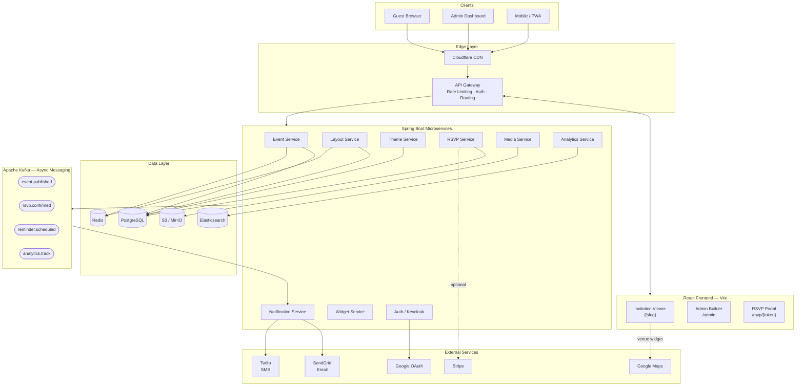

### Event lifecycle state machine

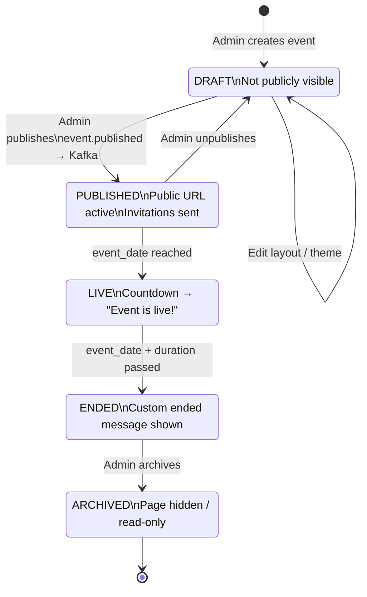

### Service communication

- **Synchronous:** REST (JSON) between frontend and backend services via API Gateway
- **Asynchronous:** Apache Kafka for event-driven workflows (notifications, analytics, reminders)
- **Caching:** Redis caches public event pages — high read traffic, low write frequency
- **Service discovery:** Kubernetes DNS (internal) or Eureka (if not using K8s)

### Service dependency map

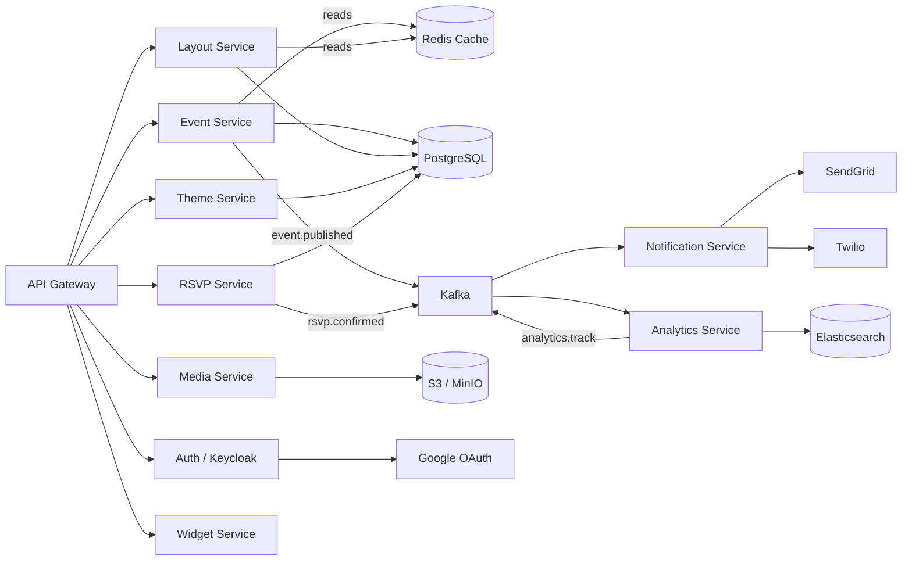

---

## 5. Frontend Architecture

### Three separate React applications (Vite)

#### 5.1 Invitation Viewer App — `/{event-slug}`

The public-facing event page. Renders the layout JSON for the given slug.

```
src/
├── pages/
│   └── EventPage.tsx          # Route: /:slug
├── components/
│   └── widgets/               # One component per widget type
│       ├── HeroBanner.tsx
│       ├── CountdownTimer.tsx
│       ├── EventDetails.tsx
│       ├── RsvpForm.tsx
│       ├── MapWidget.tsx
│       ├── Gallery.tsx
│       ├── Agenda.tsx
│       └── RichText.tsx
├── hooks/
│   ├── useEventData.ts        # Fetches event + layout + theme
│   └── useCountdown.ts        # Timezone-aware countdown logic
└── theme/
    └── ThemeInjector.tsx      # Injects CSS custom properties
```

**Flow:**
1. Page loads `/{slug}`
2. Fetch `GET /api/events/{slug}` → returns event metadata + layout JSON + theme tokens
3. `ThemeInjector` sets CSS variables on root element
4. `LayoutRenderer` iterates `sections[]` array and renders matching widget components in order
5. If `?t={inviteToken}` is present, personalize greeting and pre-fill RSVP

#### 5.2 Admin Builder App — `/admin`

The drag-and-drop event page builder.

```
src/
├── pages/
│   ├── Dashboard.tsx          # Event list
│   ├── EventEditor.tsx        # Builder canvas
│   └── ThemeEditor.tsx        # Visual theme controls
├── builder/
│   ├── Canvas.tsx             # DnD drop zone
│   ├── SectionPalette.tsx     # Available widgets sidebar
│   ├── SectionItem.tsx        # Draggable section
│   └── PropEditor.tsx         # Right-panel prop editor
└── store/
    └── builderStore.ts        # Zustand store for layout state
```

**Drag-drop library:** `@dnd-kit/core` + `@dnd-kit/sortable`

- Sections dragged from the palette onto the canvas
- Sections reordered by dragging within the canvas
- Clicking a section opens its prop editor in the right panel
- "Preview" button opens `/{slug}?preview=true` in a new tab (auth-gated)

### Admin builder flow

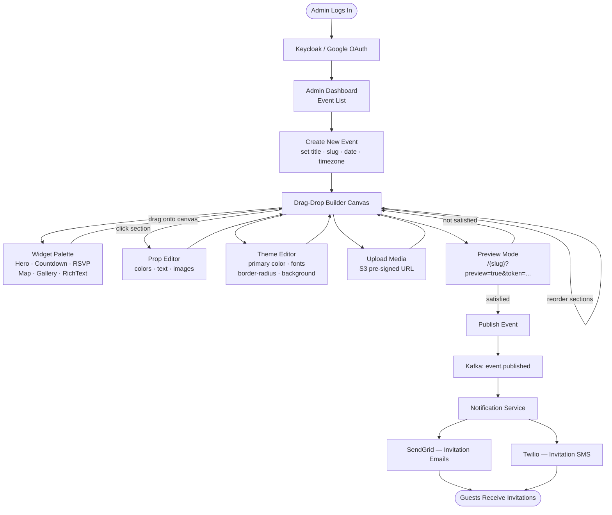

#### 5.3 RSVP & Guest Portal — `/rsvp/{inviteToken}`

- Guest confirms attendance
- Fills dynamic fields defined by the event organizer
- Selects +1 / dietary preferences
- Receives confirmation email

### Shared packages (monorepo with pnpm workspaces or Nx)

```
packages/
├── ui/              # Shared design system components
├── api-client/      # Generated API types (OpenAPI → TypeScript)
└── theme-utils/     # CSS variable injection, token helpers
```

---

## 6. Backend Services

All services are Spring Boot 3.x, Java 21, built as independent deployable JARs.

### 6.1 Event Service

Manages event lifecycle, slugs, and metadata.

**Endpoints:**

| Method | Path | Description |
|--------|------|-------------|
| `POST` | `/api/events` | Create new event |
| `GET` | `/api/events/{slug}` | Get public event data |
| `PUT` | `/api/events/{slug}` | Update event metadata |
| `PUT` | `/api/events/{slug}/publish` | Publish event (makes URL live) |
| `GET` | `/api/events` | List events (admin, paginated) |
| `DELETE` | `/api/events/{slug}` | Archive event |

**Slug generation:**
- Provided by admin (validated: lowercase, hyphens only, unique)
- Auto-generated from event title if not provided
- Indexed for O(1) lookup

### 6.2 Layout Service

Manages the drag-and-drop layout JSON per event.

**Endpoints:**

| Method | Path | Description |
|--------|------|-------------|
| `GET` | `/api/events/{slug}/layout` | Get current layout |
| `PUT` | `/api/events/{slug}/layout` | Save layout JSON |
| `POST` | `/api/events/{slug}/layout/validate` | Validate before save |
| `GET` | `/api/widgets` | Get available widget catalog |

**Layout JSON schema:**

```json
{
  "eventSlug": "wedding-alice-bob-2025",
  "version": 1,
  "sections": [
    {
      "id": "uuid-1",
      "type": "hero",
      "order": 1,
      "props": {
        "title": "Alice & Bob",
        "subtitle": "Are getting married!",
        "bgImage": "https://cdn.example.com/events/wedding-hero.jpg",
        "textColor": "#ffffff"
      }
    },
    {
      "id": "uuid-2",
      "type": "countdown",
      "order": 2,
      "props": {
        "targetDate": "2025-12-20T18:00:00",
        "timezone": "Asia/Colombo",
        "endedMessage": "We're getting married! 🎉"
      }
    },
    {
      "id": "uuid-3",
      "type": "rsvp",
      "order": 3,
      "props": {
        "maxPlusOnes": 1,
        "deadline": "2025-12-01T00:00:00",
        "customFields": ["dietary_preference", "song_request"]
      }
    }
  ]
}
```

### 6.3 Theme Service

Manages the visual theme per event.

**Theme token model:**

```json
{
  "eventSlug": "wedding-alice-bob-2025",
  "primaryColor": "#e8a0b4",
  "secondaryColor": "#f7e7ce",
  "backgroundColor": "#fff9f5",
  "textColor": "#2d2d2d",
  "accentColor": "#c97d9a",
  "fontHeading": "Playfair Display",
  "fontBody": "Lato",
  "borderRadius": "12px",
  "tokens": {
    "--color-primary": "#e8a0b4",
    "--color-bg": "#fff9f5",
    "--font-heading": "'Playfair Display', serif",
    "--border-radius": "12px"
  }
}
```

### 6.4 RSVP Service

Manages guest responses.

**Endpoints:**

| Method | Path | Description |
|--------|------|-------------|
| `POST` | `/api/rsvp/{inviteToken}` | Submit RSVP response |
| `GET` | `/api/rsvp/{inviteToken}` | Get existing response |
| `GET` | `/api/events/{slug}/guests` | List all guests (admin) |
| `POST` | `/api/events/{slug}/guests/import` | Bulk import via CSV |

### 6.5 Notification Service

Kafka consumer that listens for events and dispatches emails/SMS.

**Consumed topics:**

| Topic | Action |
|-------|--------|
| `event.published` | Send invitation emails to guest list |
| `rsvp.confirmed` | Send confirmation email to guest |
| `reminder.scheduled` | Send reminder email/SMS |
| `rsvp.deadline.approaching` | Send last-chance reminder |

**Providers:** SendGrid (email), Twilio (SMS)

---

## 7. Drag-Drop Widget Service

This is an **isolated microservice** — changes to the widget catalog never touch the core event or layout services.

### Architecture

```
drag-drop-service/
├── registry/
│   ├── WidgetRegistry.java        # In-memory + DB catalog
│   ├── WidgetDefinition.java      # name, schema, defaultProps
│   └── WidgetSchemaValidator.java # Validates props against JSON schema
├── api/
│   ├── WidgetCatalogController.java
│   └── LayoutValidationController.java
└── plugins/
    ├── HeroWidgetDefinition.java
    ├── CountdownWidgetDefinition.java
    ├── RsvpWidgetDefinition.java
    └── MapWidgetDefinition.java
```

### Adding a new widget

To add a new widget type, a developer only needs to:

1. Create a new `WidgetDefinition` class in the `plugins/` folder
2. Define the widget's JSON schema (what props it accepts)
3. Create the corresponding React component in the frontend `widgets/` folder
4. Register the widget in the catalog (DB insert or config file entry)

Zero changes to the event service, layout service, or any other service.

### Widget catalog response

```json
{
  "widgets": [
    {
      "type": "hero",
      "label": "Hero Banner",
      "category": "layout",
      "icon": "image",
      "schema": {
        "title": { "type": "string", "required": true },
        "subtitle": { "type": "string" },
        "bgImage": { "type": "url" },
        "textColor": { "type": "color", "default": "#ffffff" }
      }
    },
    {
      "type": "countdown",
      "label": "Countdown Timer",
      "category": "interactive",
      "schema": {
        "targetDate": { "type": "datetime", "required": true },
        "timezone": { "type": "timezone", "required": true },
        "endedMessage": { "type": "string", "default": "The event has started!" }
      }
    }
  ]
}
```

---

## 8. Database Design

### PostgreSQL schema

#### `organizations`
```sql
CREATE TABLE organizations (
  id UUID PRIMARY KEY DEFAULT gen_random_uuid(),
  name VARCHAR(255) NOT NULL,
  slug VARCHAR(100) UNIQUE NOT NULL,
  created_at TIMESTAMPTZ DEFAULT NOW()
);
```

#### `users`
```sql
CREATE TABLE users (
  id UUID PRIMARY KEY DEFAULT gen_random_uuid(),
  org_id UUID REFERENCES organizations(id),
  email VARCHAR(255) UNIQUE NOT NULL,
  role VARCHAR(50) NOT NULL, -- SUPER_ADMIN, ORG_ADMIN, EVENT_MANAGER
  created_at TIMESTAMPTZ DEFAULT NOW()
);
```

#### `events`
```sql
CREATE TABLE events (
  id UUID PRIMARY KEY DEFAULT gen_random_uuid(),
  org_id UUID REFERENCES organizations(id),
  slug VARCHAR(200) UNIQUE NOT NULL,
  title VARCHAR(500) NOT NULL,
  status VARCHAR(50) DEFAULT 'DRAFT', -- DRAFT, PUBLISHED, LIVE, ENDED, ARCHIVED
  event_date TIMESTAMPTZ NOT NULL,
  timezone VARCHAR(100) NOT NULL,
  description TEXT,
  og_title VARCHAR(255),
  og_description TEXT,
  og_image_url TEXT,
  created_at TIMESTAMPTZ DEFAULT NOW(),
  updated_at TIMESTAMPTZ DEFAULT NOW()
);
CREATE INDEX idx_events_slug ON events(slug);
CREATE INDEX idx_events_status ON events(status);
```

#### `layouts`
```sql
CREATE TABLE layouts (
  id UUID PRIMARY KEY DEFAULT gen_random_uuid(),
  event_id UUID UNIQUE REFERENCES events(id),
  sections JSONB NOT NULL DEFAULT '[]',
  version INT DEFAULT 1,
  updated_at TIMESTAMPTZ DEFAULT NOW()
);
```

#### `themes`
```sql
CREATE TABLE themes (
  id UUID PRIMARY KEY DEFAULT gen_random_uuid(),
  event_id UUID UNIQUE REFERENCES events(id),
  primary_color VARCHAR(20),
  secondary_color VARCHAR(20),
  background_color VARCHAR(20),
  text_color VARCHAR(20),
  font_heading VARCHAR(100),
  font_body VARCHAR(100),
  tokens JSONB NOT NULL DEFAULT '{}'
);
```

#### `custom_fields`
```sql
CREATE TABLE custom_fields (
  id UUID PRIMARY KEY DEFAULT gen_random_uuid(),
  event_id UUID REFERENCES events(id),
  field_key VARCHAR(100) NOT NULL,
  field_label VARCHAR(255) NOT NULL,
  field_type VARCHAR(50) NOT NULL, -- text, select, checkbox, date
  options JSONB, -- for select fields
  required BOOLEAN DEFAULT FALSE,
  display_order INT NOT NULL,
  UNIQUE(event_id, field_key)
);
```

#### `guests`
```sql
CREATE TABLE guests (
  id UUID PRIMARY KEY DEFAULT gen_random_uuid(),
  event_id UUID REFERENCES events(id),
  email VARCHAR(255),
  name VARCHAR(255),
  invite_token UUID UNIQUE DEFAULT gen_random_uuid(),
  status VARCHAR(50) DEFAULT 'INVITED', -- INVITED, OPENED, RSVP_YES, RSVP_NO
  invited_at TIMESTAMPTZ DEFAULT NOW()
);
CREATE INDEX idx_guests_invite_token ON guests(invite_token);
```

#### `rsvp_responses`
```sql
CREATE TABLE rsvp_responses (
  id UUID PRIMARY KEY DEFAULT gen_random_uuid(),
  guest_id UUID UNIQUE REFERENCES guests(id),
  attending BOOLEAN NOT NULL,
  plus_ones INT DEFAULT 0,
  responded_at TIMESTAMPTZ DEFAULT NOW()
);
```

#### `rsvp_field_values`
```sql
CREATE TABLE rsvp_field_values (
  id UUID PRIMARY KEY DEFAULT gen_random_uuid(),
  rsvp_id UUID REFERENCES rsvp_responses(id),
  field_id UUID REFERENCES custom_fields(id),
  value TEXT
);
```

---

## 9. Theme System

### How it works

1. Admin sets theme tokens in the Theme Editor (color pickers, font selectors, spacing sliders)
2. Tokens saved as JSONB to `themes.tokens` in PostgreSQL
3. On public page load, `GET /api/events/{slug}` returns theme tokens
4. `ThemeInjector.tsx` injects all tokens as CSS custom properties on the root element:

```typescript
// ThemeInjector.tsx
useEffect(() => {
  const root = document.documentElement;
  Object.entries(theme.tokens).forEach(([key, value]) => {
    root.style.setProperty(key, value as string);
  });
}, [theme]);
```

5. All widget components use CSS variables, never hardcoded colors:

```css
.hero-banner {
  background-color: var(--color-bg);
  color: var(--color-text);
  font-family: var(--font-heading);
  border-radius: var(--border-radius);
}
```

### Per-section text color override

Each section's `props` object can include a `textColor` field that overrides the global theme color for that section only. The widget component applies this as an inline style on its root element.

---

## 10. Event URL & Slug Strategy

### Format

```
https://yourdomain.com/{event-slug}
```

Examples:
- `yourdomain.com/wedding-alice-bob-december-2025`
- `yourdomain.com/techconf-summit-2025`
- `yourdomain.com/john-30th-birthday`

### Slug rules

- Lowercase letters, numbers, hyphens only
- 3–200 characters
- Globally unique across the platform
- Validated on creation: `^[a-z0-9][a-z0-9-]{1,198}[a-z0-9]$`
- Auto-generated from event title if not manually set

### Reserved slugs

The following slugs are reserved and cannot be used as event names:
`admin`, `api`, `login`, `rsvp`, `preview`, `health`, `static`, `assets`

### Preview URL

Before publishing, admins can access:

```
https://yourdomain.com/{slug}?preview=true&token={previewToken}
```

This preview URL requires a valid admin session token and does not appear in public indexes.

---

## 11. Countdown Timer System

### State machine

```
UPCOMING  →  LIVE  →  ENDED
```

| State | Condition | Display |
|-------|-----------|---------|
| `UPCOMING` | `now < eventDate` | Countdown: DD HH MM SS |
| `LIVE` | `now >= eventDate AND now < eventDate + duration` | "The event is live!" |
| `ENDED` | `now >= eventDate + duration` | Custom ended message from props |

### Timezone handling

The event's `timezone` field (e.g. `Asia/Colombo`, `America/New_York`) is stored with the event. The countdown component uses `dayjs.tz()` to calculate the difference from the client's current UTC time to the event's local time.

```typescript
import dayjs from 'dayjs';
import utc from 'dayjs/plugin/utc';
import timezone from 'dayjs/plugin/timezone';

dayjs.extend(utc);
dayjs.extend(timezone);

const target = dayjs.tz(targetDate, eventTimezone);
const diff = target.diff(dayjs());
```

---

## 12. Auth & Access Control

### Roles

| Role | Permissions |
|------|-------------|
| `SUPER_ADMIN` | Full access to all organizations and events |
| `ORG_ADMIN` | Manage all events in their organization |
| `EVENT_MANAGER` | Create and manage assigned events only |
| `GUEST` | Access public event page and submit RSVP via invite token |

### Admin authentication

- JWT-based authentication (access token: 15 min, refresh token: 7 days)
- OAuth2 login via Google (optional)
- Keycloak as the identity provider (swappable with Auth0)
- Spring Security filters validate JWT on every API request

### Guest authentication

- No login required for guests
- Each guest has a unique `invite_token` (UUID v4)
- Invitation link: `/{slug}?t={inviteToken}`
- The invite token is validated server-side before showing personalized content or accepting an RSVP

---

## 13. RSVP & Guest Management

### Guest list management (admin)

- Manual add (name + email)
- Bulk import via CSV upload
- Each imported guest automatically receives a unique `invite_token`
- Admin dashboard shows: invited count, opened count, RSVP yes/no breakdown

### RSVP flow (guest)

1. Guest clicks invitation link: `/{slug}?t={abc123}`
2. System validates the invite token and loads personalized page
3. Guest fills RSVP form (attending yes/no, plus ones, custom fields)
4. On submit, `POST /api/rsvp/{inviteToken}` saves the response
5. Kafka publishes `rsvp.confirmed` event
6. Notification service sends confirmation email to guest
7. Admin dashboard updates in real time

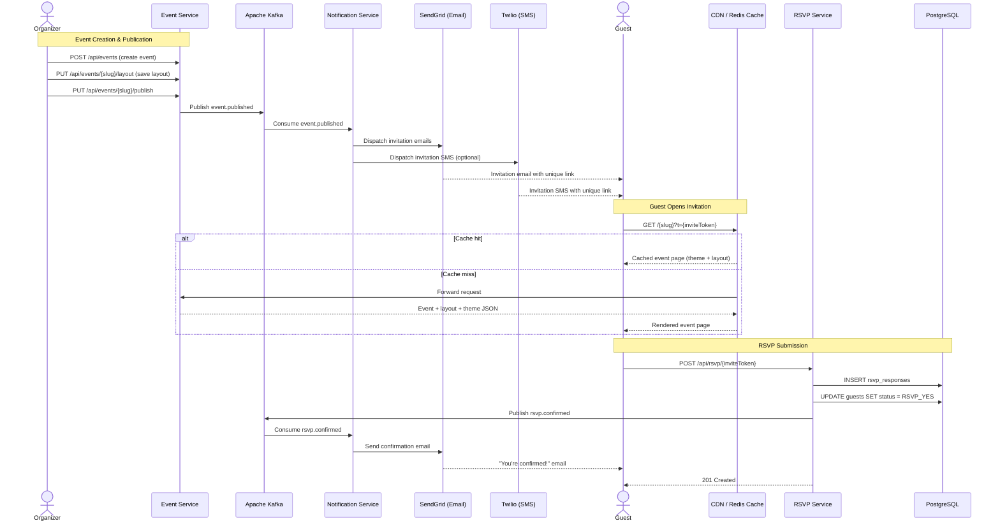

### Guest status flow

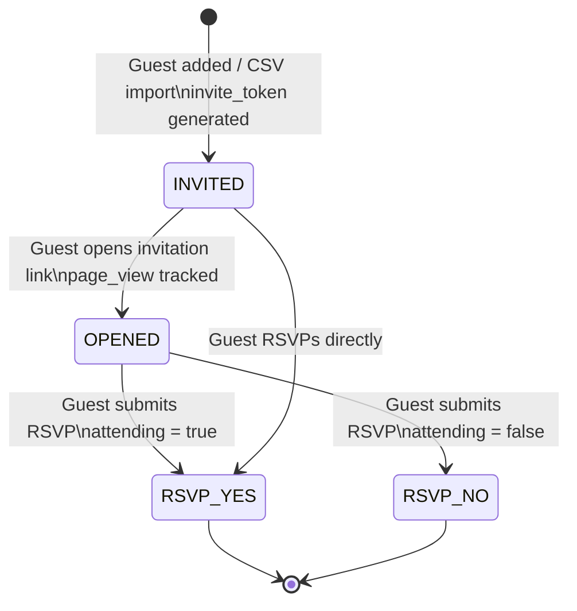

### Custom fields

Event organizers can define unlimited custom RSVP fields:

```json
[
  { "key": "dietary_preference", "label": "Dietary preference", "type": "select",
    "options": ["None", "Vegetarian", "Vegan", "Gluten-free"] },
  { "key": "song_request", "label": "Song request", "type": "text" },
  { "key": "attending_ceremony", "label": "Attending ceremony?", "type": "checkbox" }
]
```

---

## 14. Notifications

### Email templates

All email templates are event-branded — they inherit the event's primary color and logo.

| Template | Trigger | Recipient |
|----------|---------|-----------|
| Invitation | Event published / guest added | All guests |
| RSVP confirmation | Guest submits RSVP | Guest |
| Reminder (1 week) | Scheduled job | All guests without RSVP |
| Reminder (1 day) | Scheduled job | All guests without RSVP |
| Event started | Event goes LIVE | RSVP-confirmed guests |
| Summary | Event ended | Organizer |

### Reminder scheduling

When an event is published, the notification service schedules reminder jobs using a delayed Kafka message or a Spring `@Scheduled` task stored in the database.

### Notification event flow

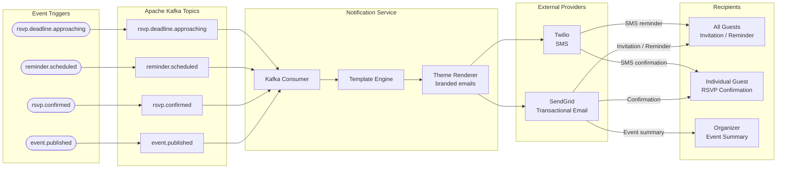

### Email templates by trigger

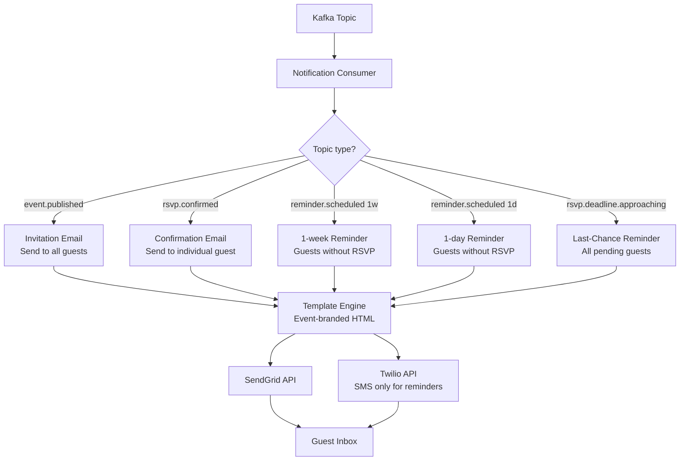

---

## 15. Media & Asset Management

### Storage

- **Provider:** AWS S3 or self-hosted MinIO
- **Bucket structure:** `/{orgSlug}/{eventSlug}/` per event
- **Types supported:** JPEG, PNG, WebP, GIF, MP4 (for video backgrounds)

### Upload flow

1. Admin requests pre-signed upload URL: `POST /api/media/presign`
2. Client uploads directly to S3 using the pre-signed URL (no proxying through Spring Boot)
3. After upload, S3 triggers a Lambda/webhook to register the asset in the database
4. CDN URL returned and stored in the event's layout/theme props

### Image optimization

- Images are automatically resized via CloudFront Lambda@Edge or imgproxy
- Served in WebP format where browser supports it
- Hero images served at appropriate breakpoints (mobile / desktop)

### Media upload flow

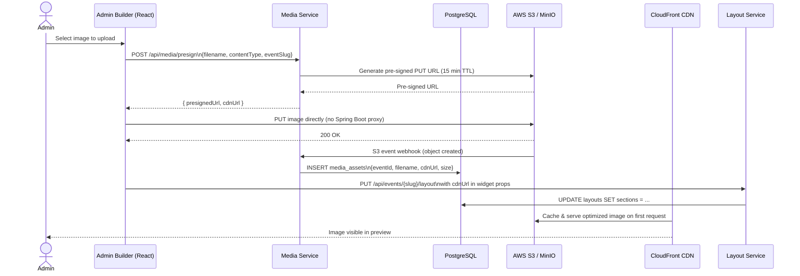

---

## 16. Analytics & Tracking

### Tracked events

| Event | Trigger |
|-------|---------|
| `page_view` | Guest opens invitation link |
| `invite_opened` | Guest with `?t=` token opens page |
| `countdown_viewed` | Countdown widget scrolled into view |
| `rsvp_started` | Guest focuses RSVP form |
| `rsvp_submitted` | Guest completes RSVP |
| `rsvp_abandoned` | Guest started RSVP but did not submit |

### Storage & querying

- Events published to Kafka `analytics.track` topic
- Kafka consumer writes to Elasticsearch
- Grafana dashboard queries Elasticsearch for per-event analytics
- Admin sees real-time: total views, RSVP rate, open rate, device breakdown

### Analytics event pipeline

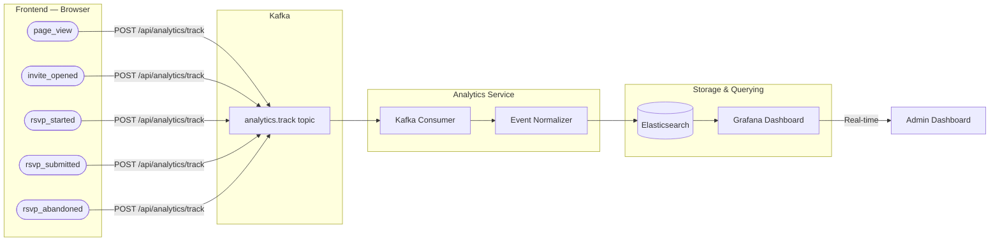

---

## 17. Infrastructure & DevOps

### Container orchestration

- All services Dockerized
- Deployed to Kubernetes (K8s) — one Deployment per service
- Horizontal Pod Autoscaler (HPA) on the public event viewer (traffic spikes on event day)

### CI/CD pipeline (GitHub Actions)

```
push to main
  → lint + test
  → build Docker image
  → push to ECR / Docker Hub
  → deploy to staging (auto)
  → deploy to production (manual approval)
```

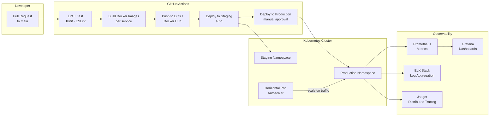

### Kubernetes deployment topology

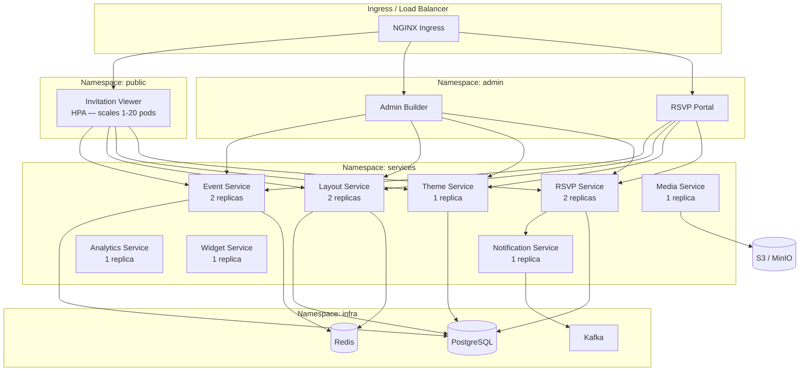

### Observability stack

| Tool | Purpose |
|------|---------|
| Prometheus | Metrics collection (JVM, HTTP latency, error rates) |
| Grafana | Dashboards and alerting |
| ELK Stack | Log aggregation and search |
| Jaeger | Distributed tracing across services |

### Environments

| Environment | Purpose |
|-------------|---------|
| `local` | Developer machines (Docker Compose) |
| `staging` | Integration testing, QA |
| `production` | Live, CDN-fronted |

---

## 18. External Integrations

| Service | Purpose | Notes |
|---------|---------|-------|
| SendGrid | Transactional email delivery | Branded email templates |
| Twilio | SMS reminders | Optional per-event setting |
| Google OAuth | Admin SSO login | Via Keycloak |
| Google Maps | Venue map widget | Embedded map in event page |
| Stripe | Paid event ticketing | Optional module |
| Cloudflare | CDN, DDoS protection | Static asset caching |
| AWS S3 / MinIO | Media storage | Event images and assets |

---

## 19. Technology Stack Summary

### Frontend

| Layer | Technology |
|-------|------------|
| Framework | React 18 + TypeScript + Vite |
| Routing | React Router v6 |
| Drag-drop | `@dnd-kit/core` + `@dnd-kit/sortable` |
| State management | Zustand (builder) + TanStack Query (server state) |
| Styling | Tailwind CSS + CSS custom properties (runtime theming) |
| Date/timezone | Day.js + `dayjs/plugin/timezone` |
| Build | Vite + pnpm monorepo |

### Backend

| Layer | Technology |
|-------|------------|
| Framework | Spring Boot 3.x, Java 21 |
| ORM | Spring Data JPA + Hibernate |
| Database migrations | Flyway |
| Messaging | Apache Kafka (Spring Kafka) |
| Caching | Redis (Spring Cache) |
| Auth | Spring Security + JWT + Keycloak |
| API docs | Springdoc OpenAPI 3 |
| Testing | JUnit 5 + Mockito + Testcontainers |

### Data

| Store | Usage |
|-------|-------|
| PostgreSQL 16 | Primary relational data (events, layouts, guests) |
| Redis 7 | Session store, event page cache (30s TTL) |
| S3 / MinIO | Media assets |
| Elasticsearch 8 | Analytics events, full-text search |

### Infrastructure

| Tool | Usage |
|------|-------|
| Docker | Container images |
| Kubernetes | Container orchestration |
| GitHub Actions | CI/CD |
| Prometheus + Grafana | Metrics |
| ELK Stack | Logging |
| Apache Kafka | Async messaging |
| Cloudflare / CloudFront | CDN |

---

## 20. Development Roadmap

### Phase 1 — Foundation (Weeks 1–4)

- [ ] PostgreSQL schema + Flyway migrations
- [ ] Event Service (CRUD, slug validation, lifecycle)
- [ ] Layout Service (save/load layout JSON)
- [ ] Theme Service (save/load theme tokens)
- [ ] Basic Invitation Viewer app (static layout render)
- [ ] ThemeInjector (CSS variable injection)

### Phase 2 — Builder & Widgets (Weeks 5–8)

- [ ] Drag-Drop Widget Service (registry, catalog API)
- [ ] Admin Builder UI (canvas, palette, prop editor)
- [ ] Core widgets: Hero, Countdown, EventDetails, RichText
- [ ] Theme Editor UI (color pickers, font selectors)
- [ ] Preview mode

### Phase 3 — RSVP & Guests (Weeks 9–12)

- [ ] Guest management (import, invite token generation)
- [ ] RSVP Service + submission flow
- [ ] Custom fields system
- [ ] RSVP form widget
- [ ] Kafka messaging setup
- [ ] Notification Service (email via SendGrid)

### Phase 4 — Media, Analytics & Polish (Weeks 13–16)

- [ ] S3/MinIO media upload
- [ ] Analytics event tracking → Elasticsearch
- [ ] Admin analytics dashboard
- [ ] Map widget (Google Maps)
- [ ] Gallery widget
- [ ] Mobile responsiveness audit
- [ ] Open Graph / SEO meta tags

### Phase 5 — Production Hardening (Weeks 17–20)

- [ ] Redis caching for public event pages
- [ ] Kubernetes deployment configs + HPA
- [ ] CI/CD pipeline (GitHub Actions)
- [ ] Prometheus + Grafana observability
- [ ] Load testing (public page under simulated event-day traffic)
- [ ] Security audit (JWT, invite token, OWASP checks)

---

*Document version 1.0 — generated as part of initial architecture design.*
